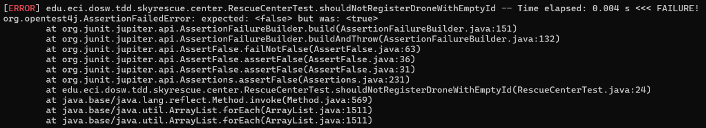
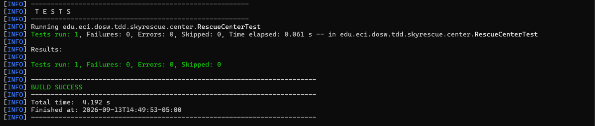
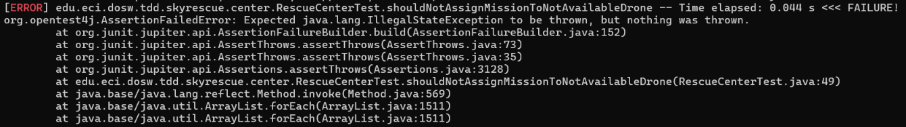
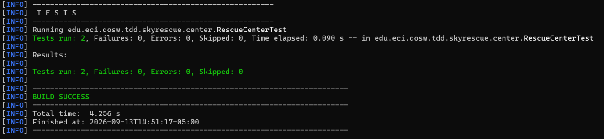
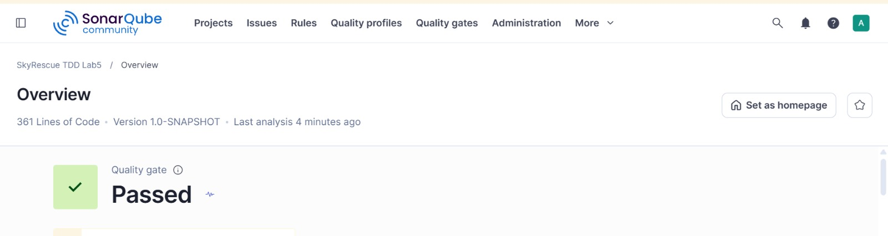

# SkyRescue - Laboratorio TDD, Cobertura y Análisis Estático

**Escuela Colombiana de Ingeniería Julio Garavito**
**Curso:** Desarrollo y Operaciones de Software - DOSW

---

## Integrantes

- Jerónimo Moreno Herrera
- [Nombre 2]
- [Nombre 3]
- [Nombre 4]

---

## Descripción de SkyRescue

SkyRescue es una plataforma para coordinar drones que apoyan operaciones de emergencia, transportando kits médicos, cámaras térmicas o radios hacia zonas de difícil acceso. El centro de operaciones registra drones y operadores, asigna misiones y las cierra cuando el dron regresa.

Reglas principales del dominio: 
- Un dron no puede asignarse si ya está ocupado o si la distancia supera su autonomía
- Un operador no puede tener dos misiones activas simultáneas. 
- Una misión no puede cerrarse dos veces.

Las tres operaciones desarrolladas con TDD son `addDrone`, `assignMission` y `completeMission`.

---

## Evidencia TDD

### Ciclo TDD - registrar un dron inválido (`addDrone`)

**RED:** prueba que demuestra que no se puede añadir un dron con un id vacío.

**GREEN:** se verifica que el id del dron no sea un String vacio antes de guaradrlo en el centro de rescate.

**REFACTOR:** se añadió la verificación de que el id del dron no sea nulo ni sea un espacio en blanco.

---

### Ciclo TDD - asignación de misión (`assignMission`)

**RED:** prueba que demuestra que no se puede asignar una misión con un dron que no esté disponible

**GREEN:** implementación mínima que hace pasar la prueba.

**REFACTOR:** se añade `else` a la estructura para conservar las buenas prácticas según las pruebas estáticas.

---

## Evidencia de cobertura

### Primera ejecución

When running the initial tests, all methods executed correctly, but the code coverage was 81%. Therefore, the methods that were not yet covered were identified and distributed among the team members to add the necessary tests and reach a minimum coverage of 85%.

### Cobertura final

---

## SonarQube

Captura del dashboard con análisis terminado, cobertura, issues encontrados y estado del Quality Gate.

[Quality Gate: aprobado / observaciones si no se pudo aprobar en el entorno local]

---

## Pull Requests

- PR JUnit: #[1](https://github.com/DoswTeam/DOSW_Lab5_Garcia_Moreno_Novoa_Pachon/pull/1)
- PR clases base: #[2](https://github.com/DoswTeam/DOSW_Lab5_Garcia_Moreno_Novoa_Pachon/pull/2)
- PR TDD addDrone: #[3]()
- PR TDD assignMission: #[4]()
- PR TDD completeMission: #[5]()
- PR JaCoCo: #[6]()
- PR SonarQube: #[7]()

---

## Reflexión técnica

1. **¿Qué error o comportamiento inesperado fue detectado primero gracias a una prueba?**
   [respuesta del equipo]

2. **¿Qué parte del código cambió durante REFACTOR sin modificar el comportamiento?**
   [respuesta del equipo]

3. **¿Qué casos adicionales aparecieron al revisar la cobertura?**
   [respuesta del equipo]

4. **¿Qué hallazgo de SonarQube produjo un cambio real en el código?**
   [respuesta del equipo]
