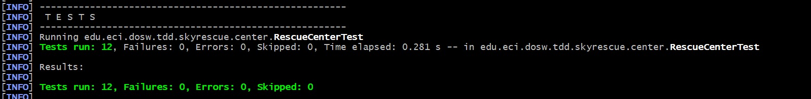
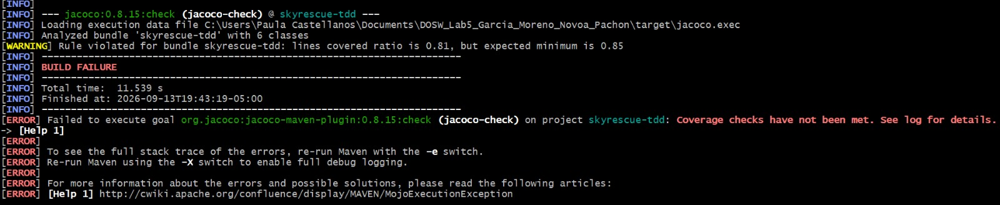
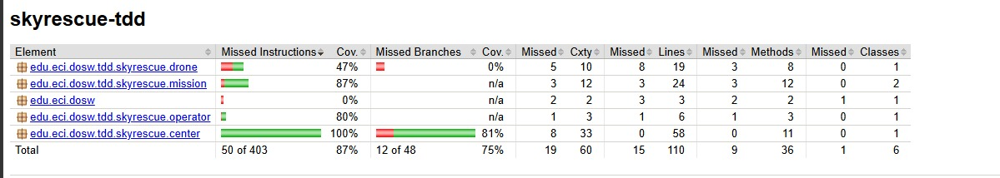

# SkyRescue - Laboratorio TDD, Cobertura y Análisis Estático

**Escuela Colombiana de Ingeniería Julio Garavito**
**Curso:** Desarrollo y Operaciones de Software - DOSW

---

## Integrantes

| Nombre completo                       | Correo institucional                                                                        | Usuario de GitHub | Correo de GitHub                                                                            |
| ------------------------------------- | ------------------------------------------------------------------------------------------- | ----------------- | ------------------------------------------------------------------------------------------- |
| **Jeronimo Moreno H.**                | [jeronimo.moreno-h@mail.escuelaing.edu.co](mailto:jeronimo.moreno-h@mail.escuelaing.edu.co) | **Dracodec113**   | [jeronimo.moreno-h@mail.escuelaing.edu.co](mailto:jeronimo.moreno-h@mail.escuelaing.edu.co) |
| **Derly Pachón Pinzón**               | [derly.pachon-p@mail.escuelaing.edu.co](mailto:derly.pachon-p@mail.escuelaing.edu.co)       | **itsValePp**     | [dv.pachonpinzon@gmail.com](mailto:dv.pachonpinzon@gmail.com)                               |
| **Paula Alejandra Novoa Castellanos** | [paula.novoa-c@mail.escuelaing.edu.co](mailto:paula.novoa-c@mail.escuelaing.edu.co)         | **Aleja15-31**    | [paula.novoa-c@mail.escuelaing.edu.co](mailto:paula.novoa-c@mail.escuelaing.edu.co)         |
| **José Daniel Gracía Pineda** | [jose.gpineda@mail.escuelaing.edu.co](mailto:jose.gpineda@mail.escuelaing.edu.co)         | **Kenji-Master**    | [jose.gpineda@mail.escuelaing.edu.co](mailto:jose.gpineda@mail.escuelaing.edu.co)         |
---

## Descripción de SkyRescue

SkyRescue es una plataforma para coordinar drones que apoyan operaciones de emergencia, transportando kits médicos, cámaras térmicas o radios hacia zonas de difícil acceso. El centro de operaciones registra drones y operadores, asigna misiones y las cierra cuando el dron regresa.

Reglas principales del dominio: 
- Un dron no puede asignarse si ya está ocupado o si la distancia supera su autonomía
- Un operador no puede tener dos misiones activas simultáneas. 
- Una misión no puede cerrarse dos veces.

Las tres operaciones desarrolladas con TDD son `addDrone`, `assignMission` y `completeMission`.

---

## Evidencia TDD

### Ciclo TDD - registrar un dron inválido (`addDrone`)

**RED:** prueba que demuestra que no se puede añadir un dron con un id vacío.

**GREEN:** se verifica que el id del dron no sea un String vacio antes de guaradrlo en el centro de rescate.

**REFACTOR:** se añadió la verificación de que el id del dron no sea nulo ni sea un espacio en blanco.

---

### Ciclo TDD - asignación de misión (`assignMission`)

**RED:** prueba que demuestra que no se puede asignar una misión con un dron que no esté disponible

**GREEN:** implementación mínima que hace pasar la prueba.

**REFACTOR:** se añade `else` a la estructura para conservar las buenas prácticas según las pruebas estáticas.

---

## Evidencia de cobertura

### Primera ejecución

When running the initial tests, all methods executed correctly, but the code coverage was 81%. Therefore, the methods that were not yet covered were identified and distributed among the team members to add the necessary tests and reach a minimum coverage of 85%.

### Cobertura final

---

## SonarQube

Captura del dashboard con análisis terminado, cobertura, issues encontrados y estado del Quality Gate.

[Quality Gate: aprobado / observaciones si no se pudo aprobar en el entorno local]

---

## Pull Requests

- PR JUnit: #[1](https://github.com/DoswTeam/DOSW_Lab5_Garcia_Moreno_Novoa_Pachon/pull/1)
- PR clases base: #[2](https://github.com/DoswTeam/DOSW_Lab5_Garcia_Moreno_Novoa_Pachon/pull/2)
- PR tdd: #[3](https://github.com/DoswTeam/DOSW_Lab5_Garcia_Moreno_Novoa_Pachon/pull/7)
- PR JaCoCo: #[6](https://github.com/DoswTeam/DOSW_Lab5_Garcia_Moreno_Novoa_Pachon/pull/13)

---

## Reflexión técnica

1. **¿Qué error o comportamiento inesperado fue detectado primero gracias a una prueba?**
   Llamabamos la misión previo a que fuera instanciada, generando errores en los que la misión era nula.

2. **¿Qué parte del código cambió durante REFACTOR sin modificar el comportamiento?**
   Se cambió la forma en la que se instanciaba el rescue center. Estabamos instanciando múltiples rescue centers.

3. **¿Qué casos adicionales aparecieron al revisar la cobertura?**
   Que el assignment no fuera invalido, que se rechazara una distancia negativa en sus menciones, que se rechazara una segunda misión activa y que se rechazara un id nulo para las misiones.

4. **¿Qué hallazgo de SonarQube produjo un cambio real en el código?**
   Mediante el esfuerzo del equipo, realizamos un trabajo sinérgico en el que sonarqube permitió la aprobación del proyecto instantáneamente.
